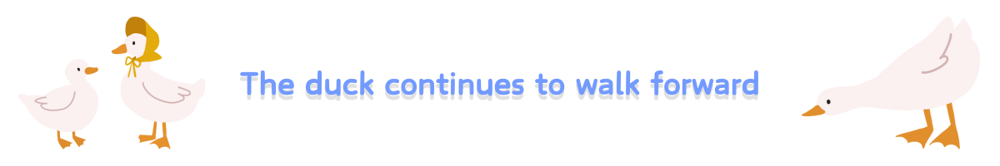
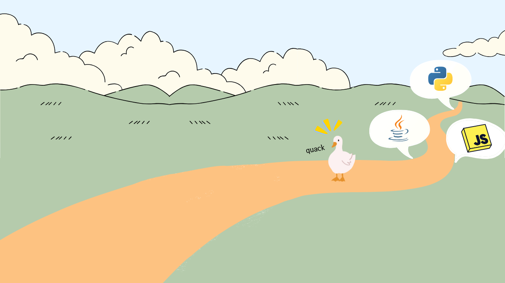
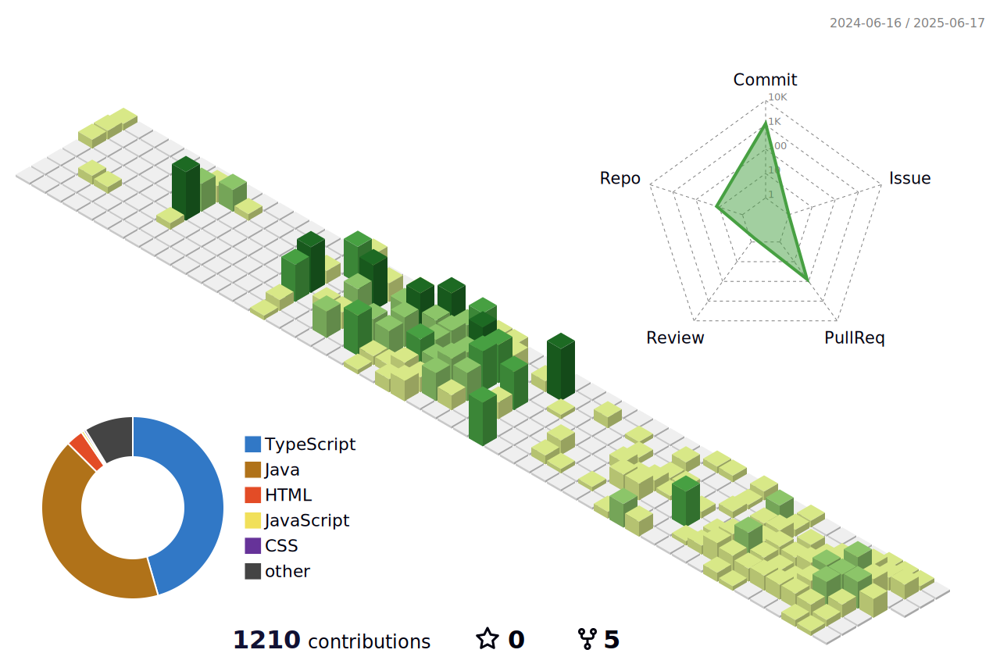

  <b>📄 <a href="https://drive.google.com/file/d/1swndBkoOHfh9_K-VgEhJeepClC6tHQap/view?usp=sharing">RESUME</a></b> &nbsp;|&nbsp;
  <b>📁 <a href="https://drive.google.com/file/d/1qwxsANx3WCl6DuRiuZjL5LloDTmkOIwH/view?usp=sharing">PORTFOLIO</a></b> &nbsp;|&nbsp;
  <b>📚 BLOG</b>: <a href="https://blog.naver.com/eggzuxi99">Happy cheese smile</a> ⏩ <a href="https://eggzuxi.github.io/">Quack Quack</a>

---

### 🦆 About Me

작은 오리발이 물밑에서 누구보다 바쁘게 움직이듯,  
직접 부딪히며 해결해가는 과정을 통해 성장하는 실전형 백엔드 개발자입니다.

---

### 💻 Tech Stack

**Language**: Java, TypeScript  
**Framework**: Spring Boot, React, Next.js  
**Database**: MariaDB, MongoDB  
**DevOps & Tools**: IntelliJ, Docker, GitHub Actions, Postman, Figma

<!--
**eggzuxi/eggzuxi** is a ✨ _special_ ✨ repository because its `README.md` (this file) appears on your GitHub profile.

Here are some ideas to get you started:

- 🔭 I’m currently working on ...
- 🌱 I’m currently learning ...
- 👯 I’m looking to collaborate on ...
- 🤔 I’m looking for help with ...
- 💬 Ask me about ...
- 📫 How to reach me: ...
- 😄 Pronouns: ...
- ⚡ Fun fact: ...
-->

